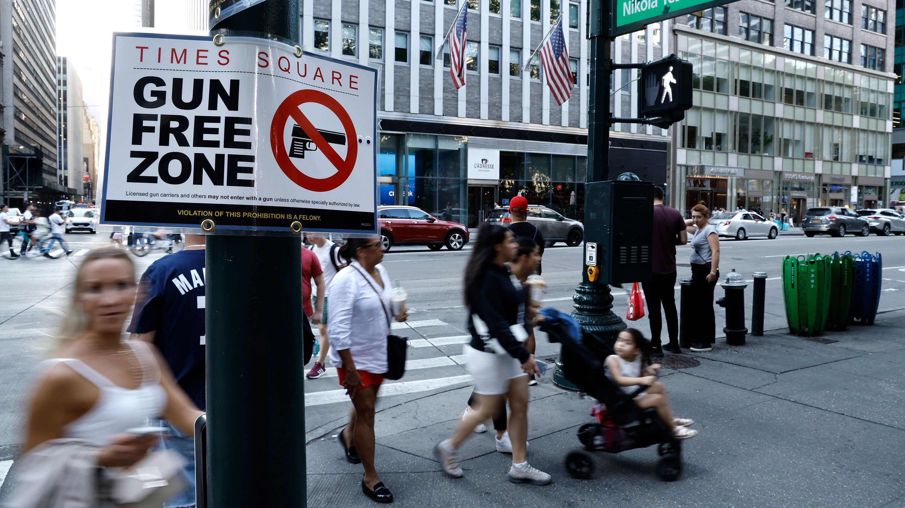

# Background
  The topic of shooting incidents worldwide raises concerns about the safety and security of various communities. On the afternoon of Nov. 6, EST, NYU Alert, the alert system of New York University, issued an emergency alert that a shooting had occurred in the Tandon neighborhood, advising people to “run if you can run, hide if you can’t run, and duel if you can’t hide.” This specific case involving an NYU student underscores the need for increased awareness and preventive measures within educational institutions. 

# Motivation
  Many schools are tasked with ensuring the safety of their students, making it essential to address and mitigate potential threats. Additionally, the safety and satisfaction of tourists and fair labor conditions for employees are key factors in maintaining the appeal of destinations like New York City. People choosing NYC as their destination are often motivated by the city’s diverse opportunities, which include education, employment, and cultural experiences. Overall, the motivation to address these interconnected issues lies in the shared goal of creating safer, more vibrant communities and environments for individuals to thrive.
  
  
# Screencast

# Website overview

- [Data Source](data_source.html): A description of the data source
- Visualization: Various plots with analysis
- Statistical Analysis: Statistical tests used to solve proposed questions
- Prediction: Time Series model to predict shooting cases
- Interactive Map: A visual map shows the incidents in different boroughs across NYC
- Project Report: The full project report is in the tab
- [About Us](about_us.html): More information about group members

# Group Members
- Sixuan Chen (sc5352)
- Junyi Ren (jr4392)
- Yixiao Sun (ys3765)
- Xiaoting Tang (xt2288)
- Yang Zhao (yz4717)

